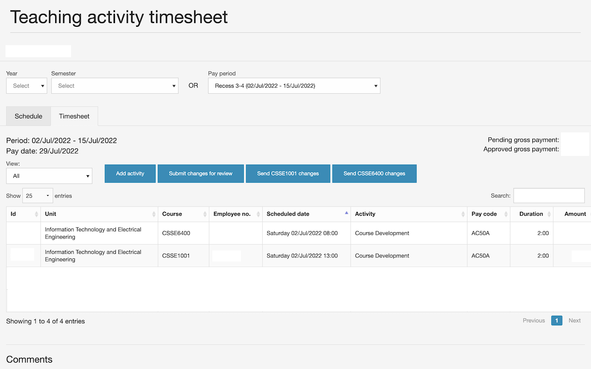
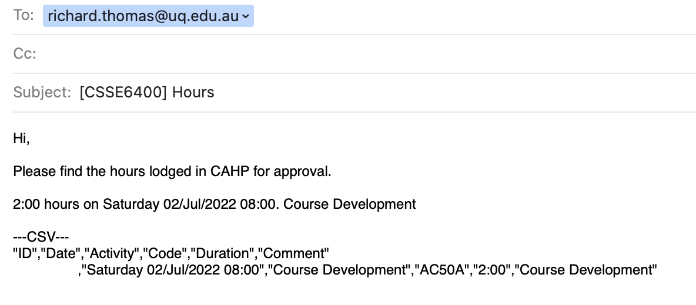
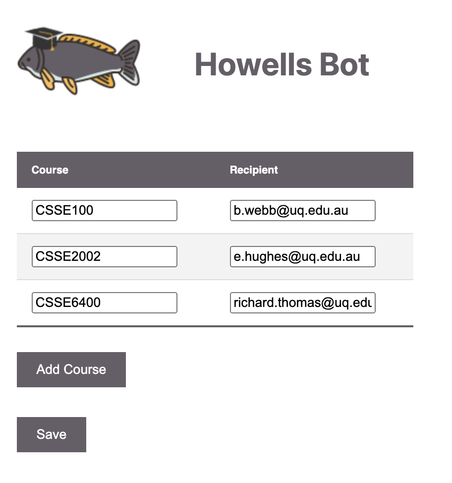

# Howller

Howller improves on the existing user experience of CAHP by including buttons which allow users to export claims to email.

Claimers are required to email their claims to their supervisor.
This requires manually putting the entered claims into an email or sending a screenshot for supervisors to manually extract.

This extension subverts that process by adding a button for each course the user has claims for. The button will send open a draft email to their supervisor with the pending claims.

Users have to configure their supervisor via the plugin.

